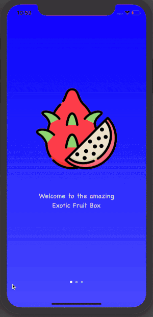

# subscription-box 
An iOS app for a subscription box for exotic fruits

## About
This app is for a subscription box for exotic fruits, but can be used as a template for other subscription box based services. 

### Features
* Splash Screen - with gradient
* Login Screen - with animation
* Home Screen - using compositional layout
* New Box Selection Screen
* History Screen
* User Profile Screen - using SwiftUI

### Basic App Walk-through

### Run Locally

Project code can be viewed locally  and run on Xcode's simulator by cloning or forking this repo.

## Built With
* [Xcode - 11.3.1](https://developer.apple.com/xcode/) - The IDE used
* [Swift - 5.1.4](https://developer.apple.com/swift/) - Programming Language

## Author(s)
* Cao Mai - portfolio can be found at:
https://www.makeschool.com/portfolio/Cao-Mai

## License

This project is licensed under the MIT License - see the [LICENSE.md](LICENSE.md) file for details

## Acknowledgments
Thanks to Adriana (Instructor), Wesley(Teacher's Assistant), and others for your help in this project!
